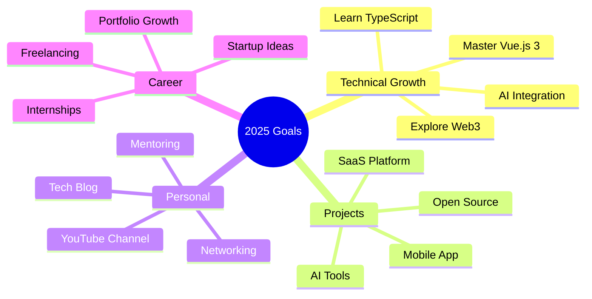
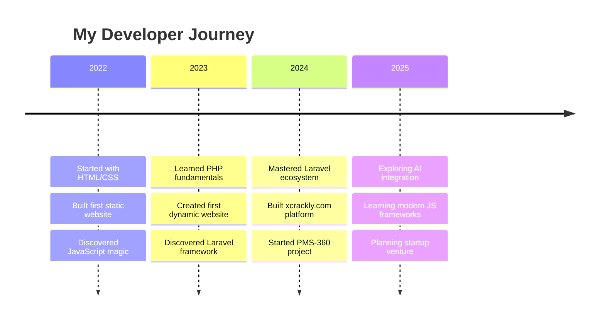

<!-- Animated Header with Particles Effect -->
<div align="center">
  
</div>

<!-- Matrix-style Animated Introduction -->
<p align="center">
  
</p>

<!-- Animated Profile Views Counter -->
<div align="center">
  
  
  
</div>

---

## 🌊 Wave of Innovation

<div align="center">
  
  
</div>

<div align="center">
  
</div>

---

## 🎭 Digital Identity

<table>
<tr>
<td width="50%">

```javascript
const usman = {
    age: 15,
    location: "Pakistan 🇵🇰",
    currentStatus: "Building the future",
    languages: ["PHP", "JavaScript", "Python"],
    frameworks: ["Laravel", "Alpine.js", "Tailwind"],
    interests: ["AI", "Web3", "IoT", "Cybersecurity"],
    motto: "Code with passion, create with purpose",
    
    getCurrentProject() {
        return "Revolutionary APK platform";
    },
    
    getDreamJob() {
        return "Tech entrepreneur changing the world";
    }
};
```

</td>
<td width="50%">


### 🎯 **Mission Statement**
*Transforming ideas into digital reality, one commit at a time. Building tomorrow's solutions with today's cutting-edge technology.*

### ⚡ **Quick Stats**
- 🔥 **2+ years** of coding experience
- 🌟 **10+ projects** completed
- 🚀 **Always learning** new technologies
- 💡 **Innovation-driven** mindset

</td>
</tr>
</table>

---

## 🌟 Stellar Projects Galaxy

<div align="center">
  
</div>

### 🏆 **Flagship Projects**

<div align="center">

| 🌐 Project | 📊 Status | 💻 Tech | 🎯 Impact | 🔗 Links |
|:----------:|:---------:|:--------:|:---------:|:--------:|
| **xcrackly.com** | 🟢 Live | Laravel + JS | 1000+ Users | [](https://xcrackly.com/) |
| **PMS-360** | 🟡 Beta | Laravel 12 | Enterprise | [](https://pms.clouderp360.com/) |
| **AI Assistant** | 🟠 Development | PHP + OpenAI | Coming Soon | [](#) |
| **Mobile App** | 🔵 Planning | React Native | Future | [](#) |

</div>

---

## 🚀 Technology Mastery

<div align="center">
  
</div>

### 🎨 **Skill Constellation**

<table align="center">
<tr>
<td align="center" width="25%">

**🔥 Backend**
<br><br>

<br>


</td>
<td align="center" width="25%">

**🎨 Frontend**
<br><br>

<br>


</td>
<td align="center" width="25%">

**🗄️ Database**
<br><br>

<br>


</td>
<td align="center" width="25%">

**🛠️ DevOps**
<br><br>

<br>


</td>
</tr>
</table>

---

## 📊 Performance Dashboard

<div align="center">
  
<!-- Contribution Graph -->


<!-- Detailed Stats -->


</div>

---

## 🎵 Vibe Check

<div align="center">
  
</div>

---

## 🏅 Achievement Unlocked

<div align="center">
  
[](https://github.com/iblameusman)

</div>

---

## 🌈 Code Philosophy

<div align="center">
  
</div>

---

## 🎯 2025 Roadmap



---

## 💻 Development Environment

<div align="center">

| 🛠️ Tool | ⭐ Rating | 📝 Note |
|:-------:|:---------:|:-------:|
| **VS Code** | ⭐⭐⭐⭐⭐ | Primary IDE with 20+ extensions |
| **Laravel Herd** | ⭐⭐⭐⭐⭐ | Perfect local development |
| **Git + GitHub** | ⭐⭐⭐⭐⭐ | Version control master |
| **Postman** | ⭐⭐⭐⭐⭐ | API testing wizard |
| **Figma** | ⭐⭐⭐⭐⭐ | UI/UX design playground |

</div>

---

## 🎨 Creative Showcase

<table>
<tr>
<td width="33%">

### 🎯 **Focus Areas**
```yaml
current_focus:
  - Advanced Laravel Features
  - Modern JavaScript (ES6+)
  - AI/ML Integration
  - Cloud Architecture
  - Mobile Development

next_learning:
  - Vue.js 3 Composition API
  - TypeScript
  - Docker & Kubernetes
  - AWS Services
  - Blockchain Basics
```

</td>
<td width="33%">

### 📈 **Growth Metrics**


### 🏆 **Coding Streak**


</td>
<td width="33%">

### 🎮 **Fun Zone**


### 🎲 **Random Dev Fact**


</td>
</tr>
</table>

---

## 🌟 Project Spotlight

<div align="center">
  
</div>

<table align="center">
<tr>
<td align="center" width="50%">

### 🎯 **[xcrackly.com](https://xcrackly.com/)**


**🚀 Features:**
- 📱 Android app discovery
- 🔍 Advanced search & filtering
- 👤 User accounts & reviews
- 📊 Download analytics
- 🎨 Modern responsive UI

**💻 Tech Stack:**
<br>


</td>
<td align="center" width="50%">

### ⛽ **[PMS-360](https://pms.clouderp360.com/)**


**🎯 Features:**
- 👥 Multi-shift management
- 📊 Real-time meter readings
- 📋 Comprehensive dip logs
- ⛽ Fuel tracking system
- 💰 Financial reporting

**🛠️ Architecture:**
<br>


</td>
</tr>
</table>

---

## 🎨 Skill Radar

<div align="center">
  
</div>

<table align="center">
<tr>
<td align="center">

### 🔥 **Mastery Levels**
```
Laravel      ████████████ 95%
PHP          ███████████  90%
JavaScript   ██████████   85%
HTML/CSS     ████████████ 95%
MySQL        █████████    80%
Git          ██████████   85%
Tailwind     ███████████  90%
Alpine.js    ████████     75%
```

</td>
<td align="center">

### 📈 **Learning Curve**


</td>
</tr>
</table>

---

## 🎭 The Developer's Journey

<div align="center">
  
</div>

### 🎢 **Timeline of Growth**



---

## 🎪 Interactive Zone

<div align="center">
  <details>
    <summary>🎮 <b>Click to see my coding setup!</b></summary>
    <br>
    <table>
      <tr>
        <td><strong>💻 Machine:</strong></td>
        <td>Custom Built PC</td>
      </tr>
      <tr>
        <td><strong>🖥️ Monitor:</strong></td>
        <td>Dual 24" Setup</td>
      </tr>
      <tr>
        <td><strong>⌨️ Keyboard:</strong></td>
        <td>Mechanical RGB</td>
      </tr>
      <tr>
        <td><strong>🖱️ Mouse:</strong></td>
        <td>Gaming Precision</td>
      </tr>
      <tr>
        <td><strong>🎧 Audio:</strong></td>
        <td>Noise-canceling headphones</td>
      </tr>
      <tr>
        <td><strong>☕ Fuel:</strong></td>
        <td>Coffee + Energy drinks</td>
      </tr>
    </table>
  </details>
</div>

<div align="center">
  <details>
    <summary>📚 <b>My Learning Resources</b></summary>
    <br>
    
  **📖 Favorite Learning Platforms:**
  - 🎥 YouTube (Laravel Daily, Traversy Media)
  - 📚 Laracasts (Laravel ecosystem)
  - 🌐 MDN Web Docs (Web standards)
  - 📖 PHP.net Documentation
  - 🎓 FreeCodeCamp (Full-stack)
  - 🤖 OpenAI Documentation (AI)
    
  </details>
</div>

---

## 🎯 Connect & Collaborate

<div align="center">
  
</div>

<table align="center">
<tr>
<td align="center">

### 🌐 **Find Me Online**
[](https://github.com/iblameusman)
[](https://xcrackly.com)
[](mailto:usman@xcrackly.com)
[](https://linkedin.com/in/iblameusman)

</td>
<td align="center">

### 💬 **Let's Chat About**
- 🚀 Full-stack development
- 🤖 AI & machine learning
- 💡 Startup ideas & collaboration
- 🎯 Freelance opportunities
- 📚 Tech mentoring
- 🎮 Gaming & tech trends

</td>
</tr>
</table>

---

## 🎊 Fun Stats & Achievements

<div align="center">
  
| 🏆 Achievement | 📊 Progress | 🎯 Status |
|:-------------:|:-----------:|:---------:|
| **Lines of Code** | 50,000+ |  |
| **Projects Completed** | 15+ |  |
| **Technologies Learned** | 20+ |  |
| **Coffee Consumed** | ∞ |  |

</div>

---

## 🎪 Random Developer Jokes

<div align="center">
  
</div>

---

## 🎨 Contribution Snake

<div align="center">
  <picture>
    <source media="(prefers-color-scheme: dark)" srcset="https://raw.githubusercontent.com/iblameusman/iblameusman/output/github-snake-dark.svg">
    <source media="(prefers-color-scheme: light)" srcset="https://raw.githubusercontent.com/iblameusman/iblameusman/output/github-snake.svg">
    
  </picture>
</div>

---

## ⚡ Lightning Round

<div align="center">
  
</div>

---

## 🌈 Inspiration Corner

<div align="center">
  
</div>

### 💭 **Developer Mantras**
<p align="center">
  
</p>

---

## 🎵 Currently Vibing To

<div align="center">
  
</div>

---

## 🎮 Gaming Corner

<div align="center">
  
</div>

---

## 🔮 Future Vision

<div align="center">
  
</div>

### 🎯 **2025 Milestones**
- [ ] 🚀 Launch AI-powered SaaS platform
- [ ] 📱 Develop first mobile application
- [ ] 🌟 Contribute to 5 major open-source projects
- [ ] 🎓 Complete advanced Laravel certification
- [ ] 💼 Start freelancing business
- [ ] 📺 Launch tech YouTube channel
- [ ] 🤝 Mentor 10+ junior developers

---

## 🎊 Social Proof

<div align="center">
  
[](https://github.com/iblameusman?tab=followers)
[](https://github.com/iblameusman?tab=repositories)
[](https://github.com/iblameusman?tab=repositories)
[](https://github.com/iblameusman)

</div>

---

## 🎯 Call to Action

<div align="center">
  <a href="https://github.com/iblameusman?tab=repositories">
    
  </a>
  <a href="https://xcrackly.com">
    
  </a>
</div>

---

<!-- Dynamic Footer Animation -->
<div align="center">
  
</div>

<!-- Animated Wave Footer -->
<div align="center">
  
</div>

<!-- Snake Eating Contributions Animation -->
<div align="center">
  <picture>
    <source media="(prefers-color-scheme: dark)" srcset="https://raw.githubusercontent.com/iblameusman/iblameusman/output/github-snake-dark.svg">
    <source media="(prefers-color-scheme: light)" srcset="https://raw.githubusercontent.com/iblameusman/iblameusman/output/github-snake.svg">
    
  </picture>
</div>

---

<!-- Floating Action Buttons -->
<div align="center">
  <a href="#top">
    
  </a>
  <a href="https://github.com/iblameusman/iblameusman/issues/new">
    
  </a>
</div>

<!-- Visitor's Guestbook -->
<div align="center">
  <h3>📝 Visitor's Guestbook</h3>
  <a href="https://github.com/iblameusman/iblameusman/issues/new?template=guestbook.md&title=Hi%20Usman!">
    
  </a>
</div>

<!-- Dynamic Counter -->
<div align="center">
  
</div>

---

<!-- Easter Egg -->
<div align="center">
  <details>
    <summary>🥚 <b>Easter Egg - Click for a surprise!</b></summary>
    <br>
    <div align="center">
      
      <br><br>
      
      <br><br>
      <strong>🎉 Congratulations! You found the hidden developer terminal! 🎉</strong>
    </div>
  </details>
</div>

---

<!-- Final Signature -->
<div align="center">
  
</div>

<!-- Animated Divider -->
<div align="center">
  
</div>

<!--
🎨 Profile Enhancement Ideas for Future:
- Add GitHub Actions for auto-updating stats
- Implement custom CSS animations
- Create interactive terminal widget
- Add blog post feed integration
- Include project showcase carousel
- Add testimonials section
- Create skill progress animations
- Add dark/light theme toggle
-->

<!-- Hidden Message for Fellow Developers -->
<!-- 
Hey fellow developer! 👋 
If you're reading this, you're probably curious about the code behind this profile.
Feel free to fork it and make it your own! 
Don't forget to star the repo if you found it helpful! ⭐
Happy coding! 🚀
- Usman
-->
